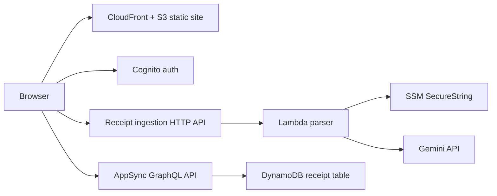

# CheckSplit

CheckSplit is a work-in-progress receipt splitting app. Goal: let a signed-in user scan a restaurant receipt, turn it into a structured draft, assign items across people or groups, track who has paid, and save the result as a reusable shared record.

This repository currently has two main pieces:

- `ui/`: Next.js frontend for marketing, auth, receipt ingestion, editing, archive, and share flows
- `infra/`: Terraform for hosting, auth, APIs, storage, CI access, and environment composition

## Current Product Shape

Today the app is built around one end-to-end flow:

1. User signs up or logs in with Cognito.
2. User starts a new receipt and uploads a photo or enters data manually.
3. Browser compresses the image to fit the ingestion API limit.
4. Cognito-protected HTTP API sends the image to a Lambda that calls Gemini and normalizes the response into the app's receipt draft shape.
5. User reviews merchant details, groups, items, discounts, tax, tip, and fees in the receipt workspace.
6. Frontend saves the receipt to a Cognito-protected AppSync GraphQL API backed by DynamoDB.
7. User can reopen saved receipts, mark groups as paid, and generate a shareable visual summary.

## Architecture Overview

At a high level, CheckSplit uses a static frontend with managed AWS backend services instead of a long-running application server.



That split keeps responsibilities clear:

- `ui/` owns UX, client-side state, form validation, and receipt editing behavior
- `receipt-ingestion-api` turns an uploaded image into a draft receipt model
- `receipt-api` owns persistence and authenticated receipt mutations
- Terraform composes the environment and deployment edges around those services

## Why Repo Split Looks Like This

### `ui/`

Frontend is a static-exported Next.js app. It still has rich authenticated behavior because the browser talks directly to Cognito, AppSync, and the receipt parsing HTTP API.

Important UI capabilities visible in code today:

- landing page explaining scan-to-split workflow
- Cognito email/password sign-up, login, and confirmation
- saved receipt archive with search, sort, and paid/unpaid grouping
- receipt workspace for manual entry or AI-assisted draft creation
- payment tracking per group
- generated receipt summary share image

See [`ui/README.md`](./ui/README.md) for frontend-specific details.

### `infra/`

Infra is organized as reusable Terraform modules plus environment composition.

Most interesting top-level pieces:

- `infra/environments/bootstrap`: one-time bootstrap for GitHub OIDC and Terraform state storage
- `infra/environments/dev`: current composed environment wiring together hosting, auth, data, and receipt ingestion
- `infra/modules/static-website-hosting`: private S3 + CloudFront + Cloudflare DNS for static deploys
- `infra/modules/cognito-auth`: Cognito user pool, client, and custom auth domain
- `infra/modules/receipt-api`: AppSync + DynamoDB receipt persistence
- `infra/modules/receipt-ingestion-api`: Cognito-protected HTTP API + Lambda + Gemini integration
- `infra/modules/github-actions-auth`: narrow AWS role for GitHub Actions via OIDC

Module READMEs are already the detailed source of truth. Use them for implementation specifics, inputs, outputs, and diagrams:

- [`infra/modules/static-website-hosting/README.md`](./infra/modules/static-website-hosting/README.md)
- [`infra/modules/cognito-auth/README.md`](./infra/modules/cognito-auth/README.md)
- [`infra/modules/receipt-api/README.md`](./infra/modules/receipt-api/README.md)
- [`infra/modules/receipt-ingestion-api/README.md`](./infra/modules/receipt-ingestion-api/README.md)
- [`infra/modules/certificates/README.md`](./infra/modules/certificates/README.md)
- [`infra/modules/github-actions-auth/README.md`](./infra/modules/github-actions-auth/README.md)

## Environment Composition

`infra/environments/dev` currently composes the main application stack:

- ACM certificate validated through Cloudflare DNS
- static site hosting for the exported frontend
- Cognito user pool and client for auth
- AppSync + DynamoDB for saved receipts
- HTTP API + Lambda for receipt parsing

The repo also includes:

- `infra/environments/bootstrap` for first-time AWS/GitHub setup
- `infra/environments/prod/terraform.tfvars` as a signal that production wiring is planned but not yet fully composed here

## Deployment Model

GitHub Actions currently handles the two main deploy surfaces:

- `.github/workflows/pr-infra-dev.yml`: plan Terraform for infra PRs
- `.github/workflows/deploy-infra-dev.yml`: apply `infra/environments/dev` on `main`
- `.github/workflows/deploy-ui-dev.yml`: build static frontend and sync `ui/out` to S3, then invalidate CloudFront

This means infra and frontend can evolve independently while still targeting one shared dev environment.

## Local Development

Frontend local dev happens from `ui/`:

```bash
cd ui
pnpm install
pnpm dev
```

The UI expects Cognito, region, GraphQL, and receipt parsing URLs in local env vars. In practice, those values come from Terraform outputs in `infra/environments/dev`.

Infra work happens from the relevant environment directory after creating `terraform.tfvars` and backend config locally or through CI secrets.

## Status

This project is still in progress. Some signals of that in the codebase:

- social auth buttons exist in the UI, but OAuth providers are not enabled in Terraform yet
- product scope is centered on the dev environment first
- module docs are stronger than root-level project docs, which is what this README is intended to fix

If you want implementation detail, start at the module READMEs and the UI README. If you want product and system intent, this root README is the overview.
