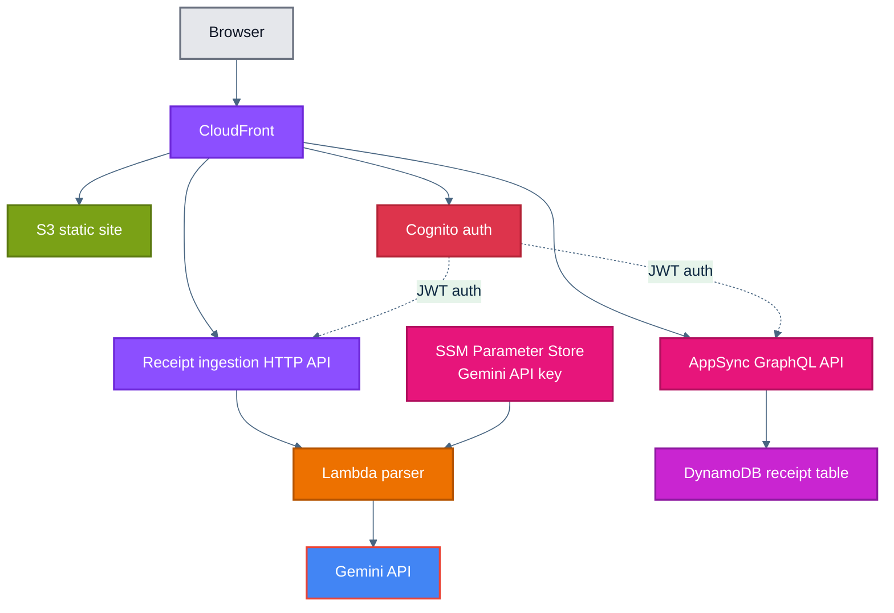

# CheckSplit

CheckSplit is a working MVP for splitting restaurant receipts. Signed-in users can scan a receipt into a structured draft, assign items across people or groups, track payments, and save the split for later reference or edits.

This repository currently has two main pieces:

- `ui/`: Includes the Next.js frontend that will statically export.
- `infra/`: Includes the Terraform modules that define the infrastructure for the application.

## Main Usage Flow

The MVP supports one complete end-to-end flow:

1. User signs up or logs in with Cognito.
2. User starts a new receipt and uploads a photo or enters data manually.
3. If a photo was uploaded, the browser compresses the image to fit the ingestion API limit (4 MB).
4. Cognito-protected HTTP API sends the image to a Lambda that calls the Gemini API and normalizes the response into the app's receipt draft shape.
5. User reviews merchant details, groups, items, discounts, tax, tip, and fees in the receipt workspace.
6. Frontend saves the receipt to a Cognito-protected AppSync GraphQL API backed by DynamoDB.
7. User can reopen saved receipts, mark groups as paid, and generate a shareable visual summary.

## Architecture Overview

At a high level, CheckSplit uses a static frontend with managed AWS backend services instead of a long-running application server. This route was chosen to scale as close to zero as possible.



## Repo Folder Structure

### `ui/`

Holds the frontend, a static-exported Next.js app. Authentication is facilitated using the Amplify js library to authenticate with Cognito. The resulting JWT is sent in the authorization header as a bearer token when communicating with backend apis.

MVP UI capabilities:

- landing page explaining general application workflow
- Cognito email/password sign-up, login, and confirmation
- saved receipt archive with search, sort, and paid/unpaid grouping
- receipt workspace for manual entry or AI-assisted draft creation
- payment tracking per group
- generated receipt summary share image

See [`ui/README.md`](./ui/README.md) for frontend-specific details.

### `infra/`

This folder contains the infrastructure definitions. It is structured with reusable Terraform modules in `infra/modules/` plus root level environment modules in `infra/environments/`.

#### Modules Overview:

- `infra/modules/static-website-hosting`: private S3 + CloudFront + Cloudflare DNS for static deploys
- `infra/modules/cognito-auth`: Cognito user pool, client configuration, and custom auth domain configuration
- `infra/modules/receipt-api`: AppSync + DynamoDB receipt persistence
- `infra/modules/receipt-ingestion-api`: Cognito-protected HTTP API + Lambda + Gemini integration
- `infra/modules/github-actions-auth`: narrow AWS role for GitHub Actions via OIDC

Module READMEs go into more detail. Use them for implementation specifics, inputs, outputs, and diagrams:

- [`infra/modules/static-website-hosting/README.md`](./infra/modules/static-website-hosting/README.md)
- [`infra/modules/cognito-auth/README.md`](./infra/modules/cognito-auth/README.md)
- [`infra/modules/receipt-api/README.md`](./infra/modules/receipt-api/README.md)
- [`infra/modules/receipt-ingestion-api/README.md`](./infra/modules/receipt-ingestion-api/README.md)
- [`infra/modules/certificates/README.md`](./infra/modules/certificates/README.md)
- [`infra/modules/github-actions-auth/README.md`](./infra/modules/github-actions-auth/README.md)

#### Environment Overview

`infra/environments/dev` is the root level module for the development environment

`infra/environments/bootstrap` includes a root level Terraform module for one-time bootstrap for:

- GitHub OIDC
- Terraform state storage
- IAM role for GitHub Actions runners

`infra/environments/prod` currently does not exist but will be the root level module for the production environment in the future

## CI/CD

GitHub Actions currently handles all CI/CD for the dev environment:

- `.github/workflows/pr-infra-dev.yml`
  - plan Terraform for infra PRs
- `.github/workflows/deploy-infra-dev.yml`
  - apply `infra/environments/dev` on `main`
- `.github/workflows/deploy-ui-dev.yml`
  - build static frontend and sync `ui/out` to S3, then invalidate CloudFront

## Local Development

Frontend local dev happens from `ui/`:

```bash
cd ui
pnpm install
pnpm dev
```

The UI expects Cognito, region, GraphQL, and receipt parsing URLs in local env vars. In practice, those values come from Terraform outputs in `infra/environments/dev`.

Infra work happens from the relevant environment directory after creating `terraform.tfvars` and backend config locally or through CI secrets.

## Project Status

CheckSplit is at the MVP stage, and the core workflow is working well end to end. Users can authenticate, create a receipt manually or from an image, review and edit the split, save it, reopen it later, track payments, and generate a shareable summary.

Current MVP scope:

- email/password authentication through Cognito
- JPEG and PNG receipt scanning with Gemini-assisted extraction
- manual receipt entry and correction of scanned data
- saved receipt history and per-group payment tracking
- AWS-hosted dev environment deployed through GitHub Actions

Production hardening and broader product features remain future work. OAuth providers are not enabled yet, and a separate production Terraform environment has not been added.

For implementation details, start with the module READMEs and the UI README. This root README covers the product and system overview.
