# Certificates Module

This module requests an ACM certificate in `us-east-1`, creates the DNS validation records in Cloudflare, and waits until ACM marks the certificate as validated.

It is designed for CloudFront-backed domains, which is why the AWS provider is pinned to `us-east-1` inside the module.

## How It Works

1. `aws_acm_certificate.this` requests a certificate for `var.root_domain`.
2. The certificate includes two SANs:
   - `var.app_subdomain`
   - `*.${var.app_subdomain}`
3. `cloudflare_dns_record.this` iterates over ACM's `domain_validation_options` and creates the required validation records in the target Cloudflare zone.
4. `aws_acm_certificate_validation.this` waits for those records to propagate and finalizes validation.

The `for_each` expression deduplicates wildcard and non-wildcard validation records by trimming the `*.` prefix from the domain name before using it as the map key. That avoids duplicate-record errors in Cloudflare.

## Architecture

```mermaid
---
config:
  theme: base
  themeVariables:
    primaryColor: "#D9EAFD"
    primaryTextColor: "#0B2545"
    primaryBorderColor: "#2F6690"
    lineColor: "#486581"
    secondaryColor: "#E6F4EA"
    tertiaryColor: "#FFF4CC"
---
flowchart LR
  A["Terraform apply"] --> B["ACM certificate request<br/>root + app SANs"]
  B --> C["ACM domain validation options"]
  C --> D["Cloudflare DNS validation records"]
  D --> E["ACM certificate validation"]
  E --> F["Validated certificate ARN"]

  classDef start fill:#FFF4CC,stroke:#C99700,color:#4A3A00,stroke-width:2px;
  classDef aws fill:#D9EAFD,stroke:#2F6690,color:#0B2545,stroke-width:2px;
  classDef dns fill:#E6F4EA,stroke:#3C6E47,color:#132A13,stroke-width:2px;
  classDef out fill:#F4D8CD,stroke:#BC6C25,color:#5F370E,stroke-width:2px;

  class A start;
  class B,C,E aws;
  class D dns;
  class F out;
```



## Example

```hcl
module "certificates" {
  source             = "../../modules/certificates"
  environment        = var.environment
  root_domain        = var.root_domain
  app_subdomain      = local.app_subdomain
  cloudflare_zone_id = var.cloudflare_zone_id
}
```

## Inputs

| Name | Type | Description |
| --- | --- | --- |
| `app_subdomain` | `string` | Application domain that should be covered by the certificate. |
| `cloudflare_zone_id` | `string` | Cloudflare zone where DNS validation records are created. |
| `root_domain` | `string` | Base domain passed to ACM as the primary certificate name. |
| `environment` | `string` | Environment label used by callers for composition. This module currently does not use it internally. |

## Outputs

| Name | Description |
| --- | --- |
| `validated_cert_arn` | ARN of the ACM certificate after DNS validation succeeds. |

## Notes

- The module requires AWS and Cloudflare credentials at apply time.
- Because CloudFront only accepts ACM certificates from `us-east-1`, this module declares its own AWS provider region instead of inheriting the caller's region.
