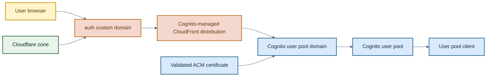
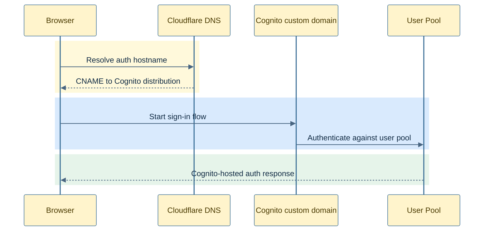

# Cognito Auth Module

This module provisions the authentication layer for the application:

- a Cognito user pool
- a Cognito user pool client
- a custom Cognito domain backed by ACM
- a Cloudflare CNAME that points the auth hostname at Cognito's managed CloudFront distribution

The result is a Cognito setup that uses the app's own domain instead of the default Cognito domain.

## How It Works

1. `aws_cognito_user_pool.this` creates the user pool with email-based sign-in and auto-verification.
2. The password policy enforces secure defaults and account recovery is limited to verified email.
3. `aws_cognito_user_pool_domain.this` attaches a custom domain to the pool using the validated ACM certificate.
4. `cloudflare_dns_record.this` creates a CNAME from `var.auth_domain` to Cognito's CloudFront distribution.
5. `aws_cognito_user_pool_client.this` creates the application client with SRP auth and refresh-token rotation enabled.

## Architecture



## Request Flow



## Example

```hcl
module "cognito-auth" {
  source                          = "../../modules/cognito-auth"
  validated_cert_arn              = module.certificates.validated_cert_arn
  environment                     = var.environment
  root_domain                     = var.root_domain
  subdomain                       = var.subdomain
  cloudflare_zone_id              = var.cloudflare_zone_id
  auth_domain                     = local.auth_subdomain
  cognito_user_pool_resource_name = local.cognito_user_pool_resource_name
  depends_on                      = [module.static-website-hosting]
}
```

## Inputs

| Name | Type | Description |
| --- | --- | --- |
| `environment` | `string` | Environment label supplied by the caller. |
| `root_domain` | `string` | Root domain for the application. Present for composition consistency; not currently used inside the module. |
| `subdomain` | `string` | Application subdomain. Present for composition consistency; not currently used inside the module. |
| `cloudflare_zone_id` | `string` | Cloudflare zone ID that will host the auth CNAME record. |
| `validated_cert_arn` | `string` | ACM certificate ARN used for the Cognito custom domain. |
| `auth_domain` | `string` | Fully-qualified auth hostname, such as `auth.dev.example.com`. |
| `cognito_user_pool_resource_name` | `string` | Resource name for the Cognito user pool. |

## Outputs

| Name | Description |
| --- | --- |
| `user_pool_id` | Cognito user pool ID. |
| `user_pool_client_id` | Cognito user pool client ID. |

## Notes

- MFA is explicitly disabled in the current implementation.
- OAuth and social identity providers are intentionally left as TODOs in the Terraform.
- In this repo, the caller waits for website hosting to exist before creating the custom auth domain. That matches the inline comment in the CDN module about Cognito's custom-domain bootstrap behavior.
