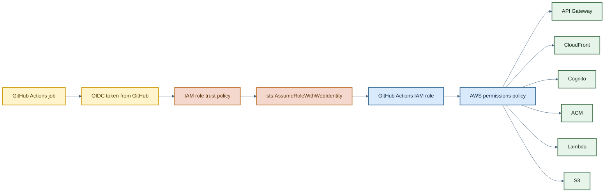
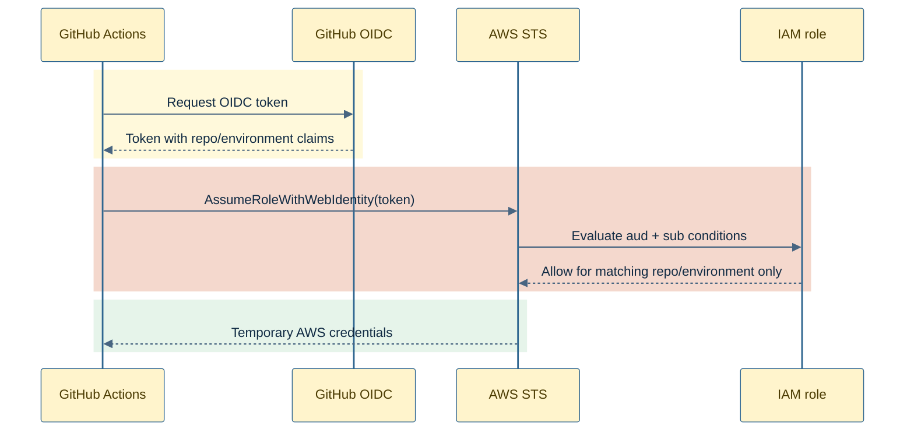

# GitHub Actions Auth Module

This module creates an IAM role that GitHub Actions can assume through GitHub's OIDC provider, then attaches a policy that grants the workflow the AWS permissions needed to manage this stack.

The trust policy is intentionally narrow: only a specific repository path and GitHub Actions environment can assume the role.

## How It Works

1. The module looks up the existing GitHub OIDC provider in AWS IAM.
2. It creates `aws_iam_role.github_actions_role` with an STS web-identity trust policy.
3. The trust policy requires:
   - audience `sts.amazonaws.com`
   - subject `repo:${var.github_repo_path}:environment:${var.github_repo_environment}`
4. It builds an IAM policy covering the specific AWS services this infrastructure needs:
   - S3 bucket and object access
   - ACM certificate lifecycle operations
   - Cognito user pool and domain management
   - CloudFront distribution, cache policy, function, and OAC management
   - API Gateway HTTP API management for receipt parsing ingress
   - Lambda and CloudWatch Logs management for the receipt parsing function
   - read access to the GitHub OIDC provider metadata
5. The policy is attached to the role and the role ARN is exported for workflow configuration.

## Architecture



## Trust Boundary



## Example

```hcl
module "dev-github-actions-auth" {
  source                  = "../../modules/github-actions-auth"
  environment             = "dev"
  repo_name               = var.repo_name
  github_repo_path        = var.github_repo_path
  github_repo_environment = var.github_repo_environment
  website_s3_bucket_arn   = var.website_s3_bucket_arn
  tfstate_s3_bucket_object = {
    arn           = aws_s3_bucket.terraform_state_storage.arn
    object_prefix = "${aws_s3_bucket.terraform_state_storage.arn}/checksplit/dev"
  }
}
```

## Inputs

| Name | Type | Description |
| --- | --- | --- |
| `environment` | `string` | Environment suffix used in IAM role and policy names. |
| `repo_name` | `string` | Repository short name used in IAM resource naming. |
| `github_repo_path` | `string` | GitHub repository path used in the OIDC subject condition, for example `owner/repo`. |
| `github_repo_environment` | `string` | GitHub Actions environment name required by the trust policy. |
| `website_s3_bucket_arn` | `string` | ARN of the website bucket that workflows need to manage. |
| `tfstate_s3_bucket_object` | `object({ arn = string, object_prefix = string })` | Terraform state bucket ARN plus the object-prefix scope for read/write object access. |

## Outputs

| Name | Description |
| --- | --- |
| `github_actions_role_arn` | IAM role ARN to configure in GitHub Actions. |

## Notes

- This module assumes the GitHub OIDC provider already exists in the account.
- The attached policy is broad enough to support the currently-managed infra modules, but it is still scoped by service and resource shape rather than using full admin access.
- The module intentionally does not grant GitHub Actions write access to the Gemini API key in SSM Parameter Store. That secret is created and rotated out of band.
