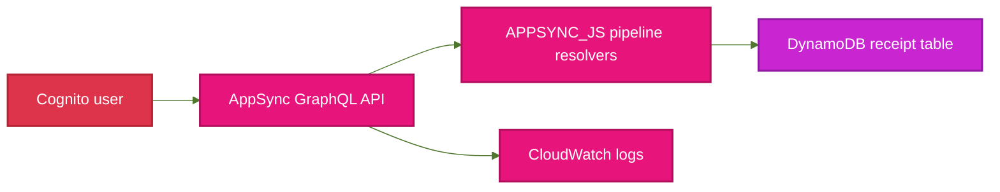
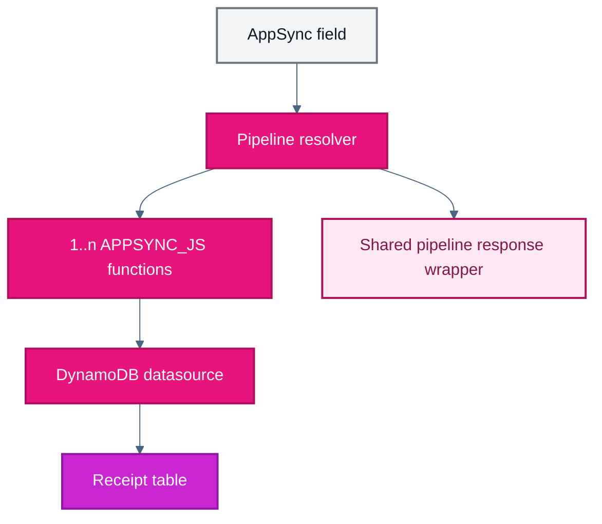
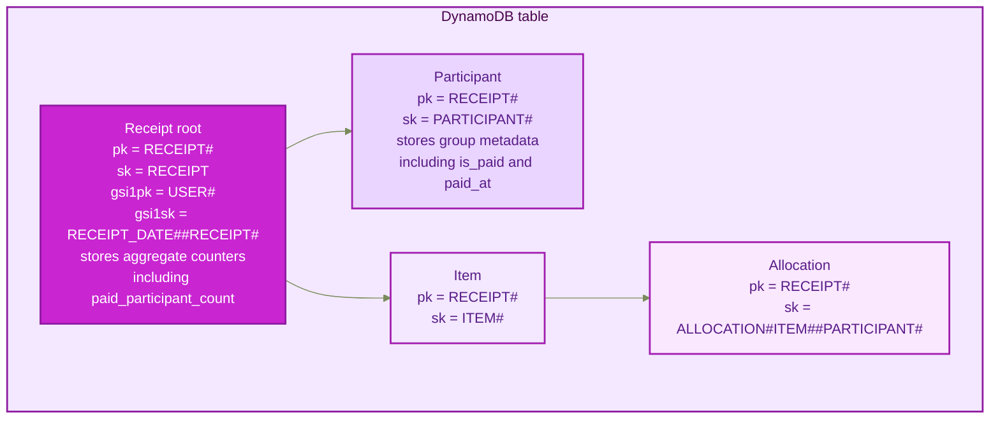
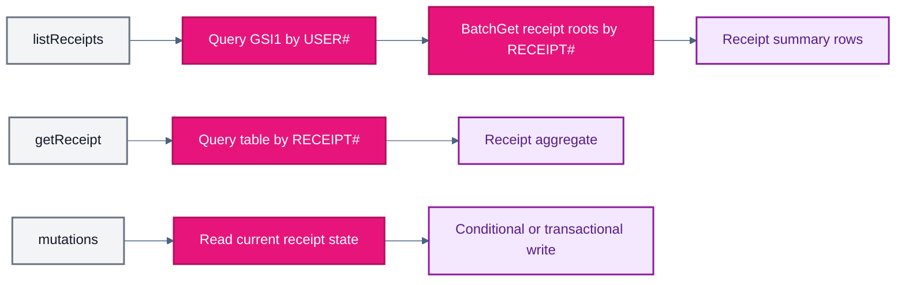
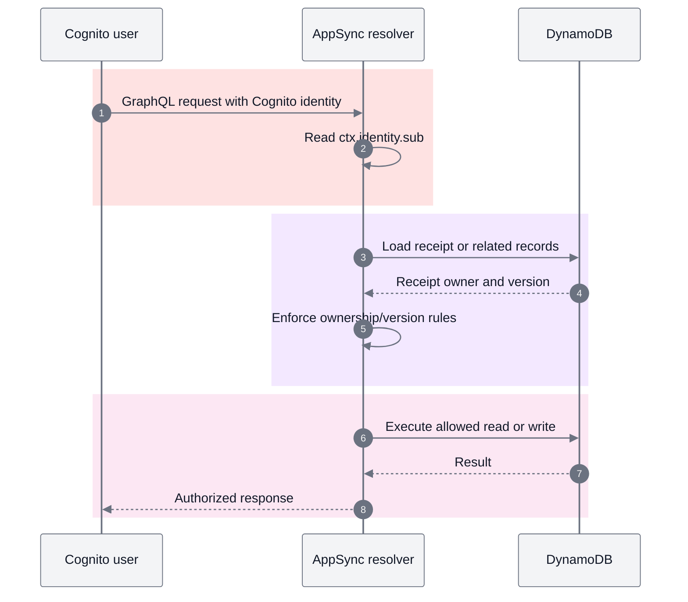

# Receipt API Module

This module provisions a Cognito-protected AppSync GraphQL API backed by a single DynamoDB table for receipt storage.

It packages three concerns into one deployable unit:

- the DynamoDB persistence layer
- the AppSync API, datasource, and pipeline resolvers
- the IAM roles AppSync needs for DynamoDB access and CloudWatch logging

## How It Works

1. `aws_dynamodb_table.receipts` creates a pay-per-request table with point-in-time recovery, server-side encryption, and one GSI for owner-based listing.
2. `aws_appsync_graphql_api.this` creates a Cognito-authenticated GraphQL API using the schema in `graphql/schema.graphql`.
3. `aws_appsync_datasource.receipts` points AppSync at the DynamoDB table.
4. `aws_appsync_function.this` renders APPSYNC_JS functions from the templates declared in `locals.tf`.
5. `aws_appsync_resolver.this` assembles those functions into pipeline resolvers, all using the shared `pipeline.js.tftpl` response wrapper.

## Example

```hcl
module "receipt-api" {
  source               = "../../modules/receipt-api"
  application_name     = local.application_name
  cognito_user_pool_id = module.cognito-auth.user_pool_id
  environment          = var.environment
}
```

## Why One Table

The receipt domain is modeled around two dominant access patterns:

- list receipts for the authenticated Cognito user
- load one full receipt aggregate with its participants, items, and allocations

A single-table design keeps those reads efficient without joins or scans:

- `listReceipts` queries one GSI keyed by `USER#<owner_user_id>`, then batch-gets receipt roots for archive-only counters such as payment progress
- `getReceipt` queries one receipt partition keyed by `RECEIPT#<receipt_id>`

That keeps the storage footprint small, limits index count to one, and makes the DynamoDB cost model predictable.

## Key Mapping

| Attribute | Source attribute | Used by |
| --- | --- | --- |
| `pk` | `receipt_id` | All entities under a receipt partition |
| `sk` | Entity discriminator plus entity ID | Receipt root, participants, items, allocations |
| `gsi1pk` | `owner_user_id` | User receipt listing |
| `gsi1sk` | `receipt_occurred_at` + `receipt_id` | Date-ordered user receipt listing |

## System Architecture



## Resolver Composition



## Single-Table Layout



## Access Patterns



## Authorization Flow



## Resolver Map

The resolver layout is declared in `locals.tf`.

| GraphQL field | Type | Pipeline functions |
| --- | --- | --- |
| `addParticipant` | `Mutation` | `add_participant` |
| `createReceipt` | `Mutation` | `create_receipt` |
| `deleteReceipt` | `Mutation` | `delete_receipt` |
| `getReceipt` | `Query` | `get_receipt` |
| `listReceipts` | `Query` | `list_receipts`, `batch_get_receipt_roots` |
| `removeReceiptItem` | `Mutation` | `query_item_allocations`, `commit_remove_item` |
| `removeParticipant` | `Mutation` | `lookup_participant`, `query_participant_allocations`, `commit_remove_participant` |
| `setItemAllocations` | `Mutation` | `query_item_allocations`, `commit_set_item_allocations` |
| `updateParticipant` | `Mutation` | `lookup_participant`, `update_participant` |
| `updateReceiptMetadata` | `Mutation` | `update_receipt_metadata` |
| `upsertReceiptItem` | `Mutation` | `lookup_item`, `commit_upsert_item` |

## Payment Tracking

- Payment state is stored on participant rows, not allocation rows.
- `is_paid` marks whether group has paid its current share.
- `paid_at` stores timestamp when group moved into paid state.
- `paid_participant_count` lives on receipt root so archive/list views can show payment progress without querying full receipt partition.
- Receipt persistence is binary: record exists in DynamoDB or it does not.

## Inputs

| Name | Type | Description |
| --- | --- | --- |
| `application_name` | `string` | Application prefix used in DynamoDB and AppSync resource names. |
| `cognito_user_pool_id` | `string` | Cognito user pool used as the GraphQL auth provider. |
| `environment` | `string` | Environment suffix used in resource names. |

## Outputs

| Name | Description |
| --- | --- |
| `dynamodb_table_arn` | ARN of the receipts table. |
| `dynamodb_table_name` | Name of the receipts table. |
| `graphql_api_arn` | ARN of the AppSync API. |
| `graphql_api_id` | AppSync API ID. |
| `graphql_api_url` | GraphQL endpoint URL. |

## Ownership Model

- The Cognito user owns the receipt through `owner_user_id`.
- Receipt participants are receipt-scoped records and are not Cognito users.
- Shared responsibility for an item is represented by allocation rows, not a separate group table.
- Group payment status is participant-scoped state and rolls up to receipt root counters for archive reads.
