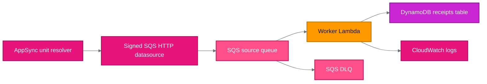

# Account Data Deletion Submodule

This submodule provisions the asynchronous cleanup pipeline used when a user deletes their account.

It is a direct child module of `receipt-api`, following the same shape as `static-website-hosting/s3-website` and `static-website-hosting/cloudfront-cdn`.

## How It Works

1. The parent `receipt-api` module exposes `requestAccountDataDeletion` as an AppSync GraphQL mutation.
2. AppSync derives the Cognito `sub` from `ctx.identity.sub`.
3. The AppSync unit resolver sends one signed SQS `SendMessage` request through an HTTP datasource.
4. The worker Lambda consumes one message at a time and deletes one bounded slice of DynamoDB rows.
5. Successful partial cleanup enqueues an immediate continuation message.
6. DynamoDB throttling changes current message visibility to 6 hours and returns a batch failure.

## Resources

| Resource                                 | Purpose                                                                    |
| ---------------------------------------- | -------------------------------------------------------------------------- |
| `aws_sqs_queue.this`                     | Standard source queue for account deletion jobs.                           |
| `aws_sqs_queue.dlq`                      | Dead-letter queue after repeated failures.                                 |
| `aws_lambda_function.worker`             | SQS worker Lambda that incrementally deletes receipt data.                 |
| `aws_lambda_event_source_mapping.worker` | Connects SQS to the worker with batch size `1`.                            |
| `aws_iam_role.appsync_sqs`               | Lets AppSync send cleanup messages to SQS.                                 |
| `aws_iam_role.worker`                    | Lets worker Lambda read/write DynamoDB, work SQS messages, and write logs. |

## Queue Settings

| Setting                     | Value                         |
| --------------------------- | ----------------------------- |
| Source queue type           | Standard                      |
| Source retention            | `1209600` seconds, 14 days    |
| DLQ retention               | `1209600` seconds, 14 days    |
| Redrive max receive count   | `5`                           |
| Default visibility timeout  | Lambda timeout plus 5 seconds |
| Event source batch size     | `1`                           |
| Event source max concurrency | `2`                           |
| Throttle visibility timeout | `21600` seconds, 6 hours      |

Repeated throttling reaches the DLQ after roughly `5 receives * 6 hours`, plus queue overhead.

The worker does not use Lambda reserved concurrency. Some AWS accounts have a concurrency quota low enough that reserving even `1` concurrency would reduce unreserved account concurrency below AWS's required floor of `10`, causing `terraform apply` to fail. The SQS event source mapping caps worker fan-out instead.

## Worker Behavior

The worker uses low DynamoDB SDK retry attempts and avoids Lambda sleep loops. It does not wait inside Lambda when DynamoDB provisioned capacity throttles.

Normal cleanup:

- Query GSI `gsi1pk = USER#` for one receipt root.
- Query one receipt partition for up to `25` child rows.
- Delete up to `25` child rows with `BatchWriteItem`.
- If child rows were deleted, enqueue an immediate same-receipt continuation.
- Delete the root row only after no child rows remain.
- After root deletion, enqueue an immediate user continuation for the next receipt.

Backpressure behavior:

- Throttled `Query` returns batch failure after trying `ChangeMessageVisibility(21600)`.
- `BatchWriteItem` with `UnprocessedItems` returns batch failure after trying `ChangeMessageVisibility(21600)`.
- If visibility change fails, normal source queue visibility controls retry timing.

## Idempotency

Duplicate messages are safe:

- A user-level message exits successfully when no receipt roots remain.
- A receipt-level continuation can re-query children and retry root deletion.
- DynamoDB deletes are naturally idempotent for missing child rows.

## Inputs

| Name                  | Type     | Description                                     |
| --------------------- | -------- | ----------------------------------------------- |
| `application_name`    | `string` | Application prefix used in resource names.      |
| `dynamodb_gsi_arn`    | `string` | ARN of the receipts DynamoDB user listing GSI.  |
| `dynamodb_gsi_name`   | `string` | Name of the receipts DynamoDB user listing GSI. |
| `dynamodb_table_arn`  | `string` | ARN of the receipts DynamoDB table.             |
| `dynamodb_table_name` | `string` | Name of the receipts DynamoDB table.            |
| `environment`         | `string` | Environment suffix used in resource names.      |
| `graphql_api_name`    | `string` | Name of the parent AppSync GraphQL API.         |

## Outputs

| Name                       | Description                                                             |
| -------------------------- | ----------------------------------------------------------------------- |
| `appsync_service_role_arn` | ARN of the AppSync service role allowed to send cleanup messages to SQS. |
| `queue_url`                | URL of the account data deletion source queue.                           |

## Architecture

