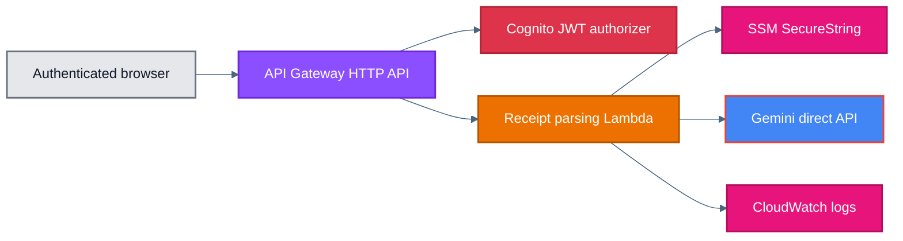

# Receipt Ingestion API Module

This module provisions a Cognito-protected HTTP API and Lambda function that accept receipt images, call the Gemini direct API, and return structured draft data that matches the app's existing receipt GraphQL inputs.

The Gemini API key is intentionally not created here. The caller supplies only the SSM parameter name, and the Lambda reads that `SecureString` value at runtime.

## How It Works

1. `aws_apigatewayv2_api.this` creates an HTTP API with narrow CORS for the app origin.
2. `aws_apigatewayv2_authorizer.this` enforces Cognito JWT authentication before the Lambda runs.
3. `aws_lambda_function.this` validates the uploaded image, reads the Gemini API key from SSM Parameter Store, calls Gemini, and normalizes the JSON response.
4. `aws_lambda_permission.this` allows only this API Gateway to invoke the function.
5. `aws_cloudwatch_log_group.this` retains Lambda logs for seven days to keep costs low.

## Architecture



## Example

```hcl
module "receipt-ingestion-api" {
  source                            = "../../modules/receipt-ingestion-api"
  application_name                  = "checksplit"
  cognito_user_pool_client_id       = module.cognito-auth.user_pool_client_id
  cognito_user_pool_id              = module.cognito-auth.user_pool_id
  environment                       = var.environment
  gemini_api_key_ssm_parameter_name = "/checksplit/dev/gemini/api-key"
  gemini_model_id                   = "gemini-3.1-flash-lite-preview"
  receipt_parse_allowed_origins     = [
    "http://localhost:3000",
    "https://dev.example.com",
  ]
  receipt_parse_max_upload_bytes    = 4194304
}
```

## Inputs

| Name | Type | Description |
| --- | --- | --- |
| `application_name` | `string` | Application name used in resource naming. |
| `cognito_user_pool_client_id` | `string` | Cognito user pool client ID used as the JWT authorizer audience. |
| `cognito_user_pool_id` | `string` | Cognito user pool ID used to construct the JWT issuer URL. |
| `environment` | `string` | Deployment environment name. |
| `gemini_api_key_ssm_parameter_name` | `string` | SSM SecureString parameter name that stores the Gemini API key. |
| `gemini_model_id` | `string` | Gemini direct API model ID used for receipt parsing. |
| `lambda_memory_size` | `number` | Memory size, in MB, for the receipt parsing Lambda. |
| `lambda_timeout_seconds` | `number` | Lambda timeout, in seconds, for receipt parsing requests. |
| `receipt_parse_allowed_origins` | `list(string)` | Browser origins allowed to call the receipt parsing HTTP API. |
| `receipt_parse_max_upload_bytes` | `number` | Maximum raw image upload size accepted by the API. |

## Outputs

| Name | Description |
| --- | --- |
| `gemini_model_id` | Gemini model ID configured for the receipt parsing Lambda. |
| `lambda_function_name` | Name of the receipt parsing Lambda function. |
| `parse_api_url` | Full receipt parsing HTTP API URL. |

## Notes

- This module intentionally does not create the Gemini API key parameter.
- The Lambda source lives under `lambda/` and is expected to be built with `pnpm install --frozen-lockfile` and `pnpm run build` so `lambda/package` contains `dist/` plus runtime dependencies from `node_modules/`.
- The Terraform CI workflows build the Lambda package before running `terraform plan` or `terraform apply`.
- The API does not expose a Lambda Function URL.
