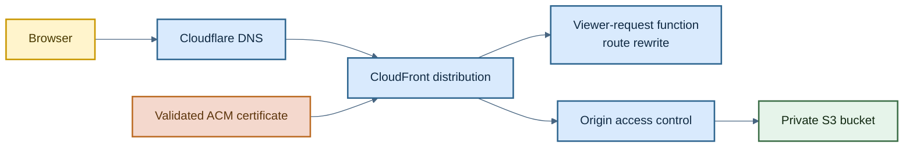
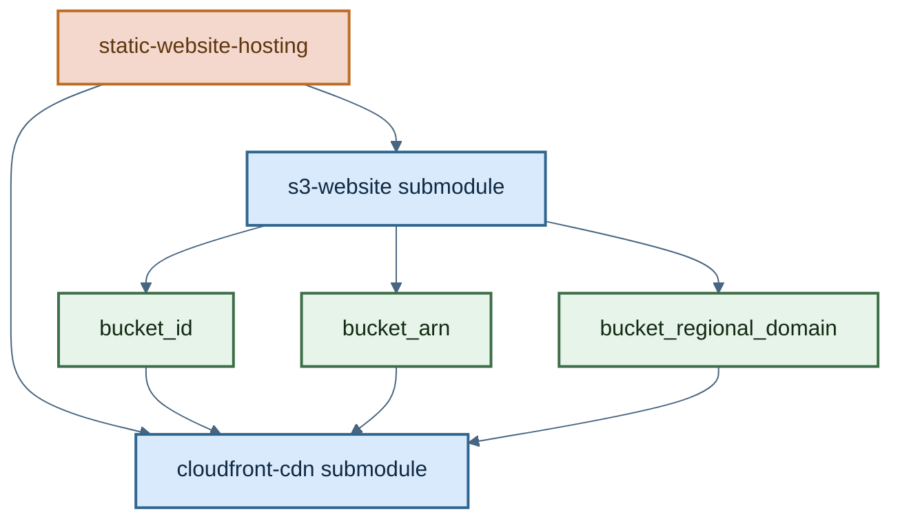

# Static Website Hosting Module

This is a composition module that assembles the application's static hosting stack from two child modules:

- [`s3-website`](./s3-website) for private object storage
- [`cloudfront-cdn`](./cloudfront-cdn) for edge delivery, TLS, route rewriting, and DNS

Use this module when you want the full website-hosting stack rather than managing the S3 and CloudFront pieces separately.

## How It Works

1. `module "s3-website"` creates the S3 bucket and blocks public access.
2. `module "cloudfront-cdn"` uses that bucket as the CloudFront origin.
3. The CDN module creates:
   - an origin access control so CloudFront can read the bucket privately
   - a cache policy optimized for static assets
   - a CloudFront Function that rewrites extensionless routes to `.html`
   - a distribution bound to the custom hostname and ACM certificate
   - a Cloudflare DNS record that points the hostname at CloudFront

## Architecture



## Module Composition



## Example

```hcl
module "static-website-hosting" {
  source                   = "../../modules/static-website-hosting"
  environment              = var.environment
  bucket_name              = var.website_s3_bucket_name
  cloudflare_zone_id       = var.cloudflare_zone_id
  acm_certificate_arn      = module.certificates.validated_cert_arn
  cloudfront_custom_domain = local.app_subdomain
}
```

## Inputs

| Name | Type | Description |
| --- | --- | --- |
| `environment` | `string` | Environment label passed to the bucket submodule. |
| `bucket_name` | `string` | Name of the S3 bucket that stores the site artifacts. |
| `cloudfront_custom_domain` | `string` | Non-apex hostname that CloudFront should answer for. |
| `acm_certificate_arn` | `string` | ACM certificate ARN used by CloudFront for TLS. |
| `cloudflare_zone_id` | `string` | Cloudflare zone where the website DNS record is created. |

## Outputs

| Name | Description |
| --- | --- |
| `s3_bucket_arn` | ARN of the S3 bucket created by the `s3-website` child module. |

## Notes

- The top-level module only exposes the bucket ARN today. If callers need CloudFront attributes, they would need additional outputs added here.
- The current implementation assumes the custom domain is not the zone apex.
