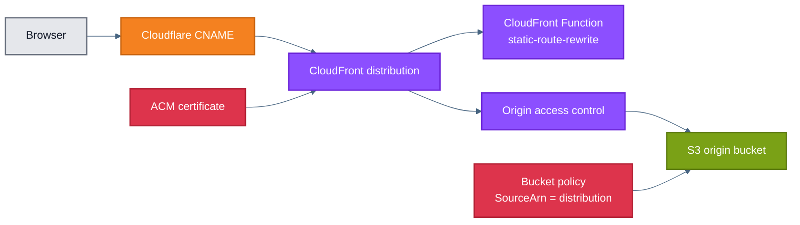
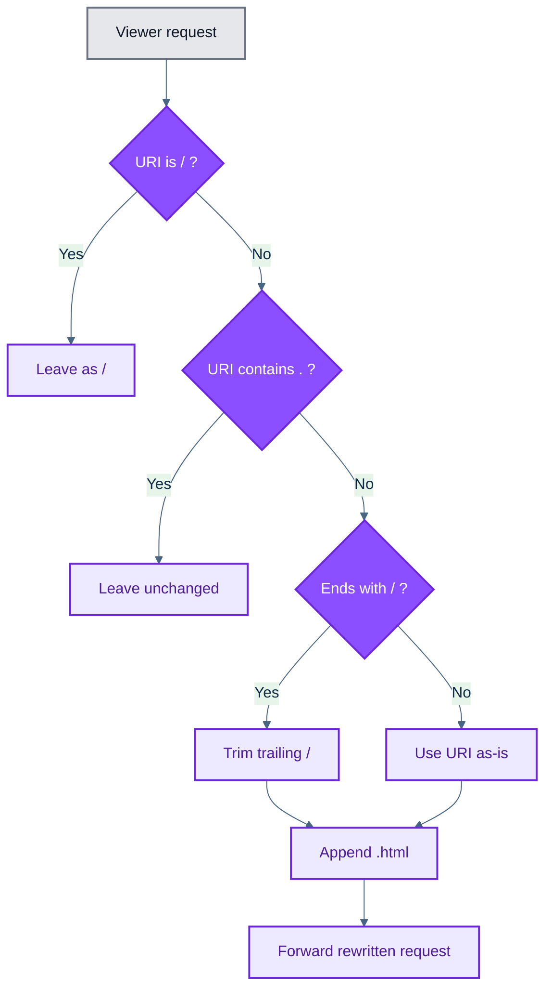

# CloudFront CDN Submodule

This submodule turns a private S3 bucket into a public website endpoint behind CloudFront and Cloudflare DNS.

It owns the edge-specific concerns:

- origin access control
- caching policy
- route rewriting for extensionless URLs
- TLS configuration with ACM
- S3 bucket policy for CloudFront access
- Cloudflare DNS for the custom hostname

## How It Works

1. `aws_cloudfront_origin_access_control.this` enables signed CloudFront access to S3.
2. `aws_cloudfront_cache_policy.this` defines a long-lived static caching profile and varies on gzip/brotli support.
3. `aws_cloudfront_function.static_route_rewrite` rewrites extensionless paths like `/pricing` to `/pricing.html`.
4. `aws_cloudfront_distribution.this` creates the CDN with HTTPS redirects, compression, and the custom hostname alias.
5. `aws_s3_bucket_policy.this` grants `s3:GetObject` only to this CloudFront distribution via `AWS:SourceArn`.
6. `cloudflare_dns_record.this` publishes the custom hostname as a CNAME to the CloudFront distribution.

CloudFront needs the ACM certificate because it must present a valid TLS certificate for the custom domain during the HTTPS handshake; the default CloudFront certificate only covers the `cloudfront.net` hostname.

## Architecture



## Request Rewrite

The rewrite is necessary because the UI is deployed with Next.js static export (`output: "export"` in [`ui/next.config.ts`](../../../ui/next.config.ts)), and that build emits concrete HTML files such as `login.html`, `dashboard.html`, and `dashboard/new.html` in `ui/out/` instead of a server that can resolve clean app routes dynamically.

Users still navigate to extensionless paths like `/login` or `/dashboard/new`. With S3 acting as a private object origin behind CloudFront, the origin lookup is by exact object key, so `/login` would not automatically resolve to `login.html`. The CloudFront Function rewrites those extensionless requests to the exported `.html` object keys before the request reaches S3.



## Example

```hcl
module "cloudfront-cdn" {
  source                         = "./cloudfront-cdn"
  s3_bucket_id                   = module.s3-website.bucket_id
  s3_bucket_arn                  = module.s3-website.bucket_arn
  s3_bucket_regional_domain_name = module.s3-website.bucket_regional_domain
  cloudfront_custom_domain       = var.cloudfront_custom_domain
  acm_certificate_arn            = var.acm_certificate_arn
  cloudflare_zone_id             = var.cloudflare_zone_id
}
```

## Inputs

| Name | Type | Description |
| --- | --- | --- |
| `s3_bucket_id` | `string` | Bucket ID used as the CloudFront origin ID and bucket-policy target. |
| `s3_bucket_arn` | `string` | Bucket ARN used in the S3 read policy. |
| `s3_bucket_regional_domain_name` | `string` | Regional S3 domain name used as the CloudFront origin domain. |
| `cloudfront_custom_domain` | `string` | Custom hostname that should resolve to the distribution. Assumed to be non-apex. |
| `acm_certificate_arn` | `string` | ACM certificate ARN used for HTTPS on the distribution. |
| `cloudflare_zone_id` | `string` | Cloudflare zone where the website CNAME is created. |

## Outputs

| Name | Description |
| --- | --- |
| `cloudfront_domain_name` | CloudFront-generated distribution domain name. |

## Notes

- The source contains commented guidance about temporarily using an A record during Cognito custom-domain bootstrap. The active resource in this module is the Cloudflare CNAME.
- Allowed methods are intentionally limited to `GET` and `HEAD`, which matches static-site delivery.
