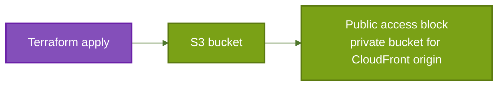

# S3 Website Submodule

This submodule creates the private S3 bucket used as the origin for the static website.

It does not configure static website hosting mode or any public bucket policy. The bucket is intended to be read only through CloudFront origin access control.

## How It Works

1. `aws_s3_bucket.this` creates the bucket and tags it with the environment.
2. `aws_s3_bucket_public_access_block.this` blocks all public ACL and bucket-policy based access paths.

## Architecture



## Example

```hcl
module "s3-website" {
  source      = "./s3-website"
  environment = var.environment
  bucket_name = var.bucket_name
}
```

## Inputs

| Name | Type | Description |
| --- | --- | --- |
| `bucket_name` | `string` | Name of the S3 bucket to create. |
| `environment` | `string` | Environment tag value applied to the bucket. |

## Outputs

| Name | Description |
| --- | --- |
| `bucket_id` | Bucket ID used by downstream modules. |
| `bucket_arn` | Bucket ARN used for policies and permissions. |
| `bucket_regional_domain` | Regional S3 domain name used as the CloudFront origin. |
